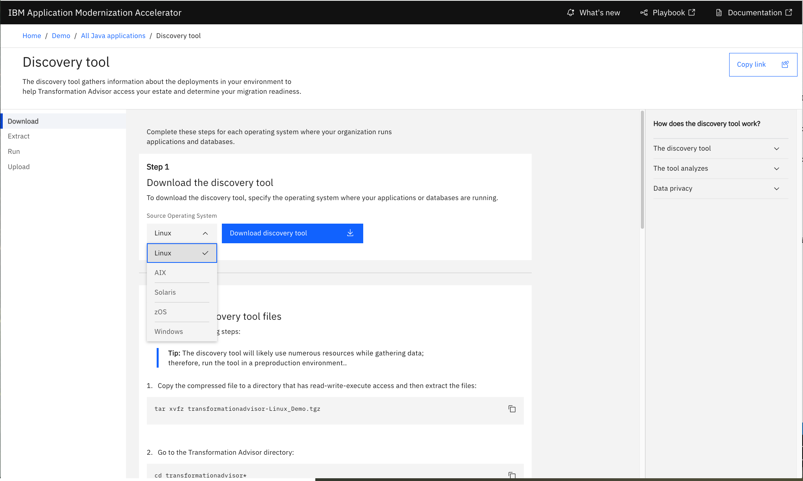
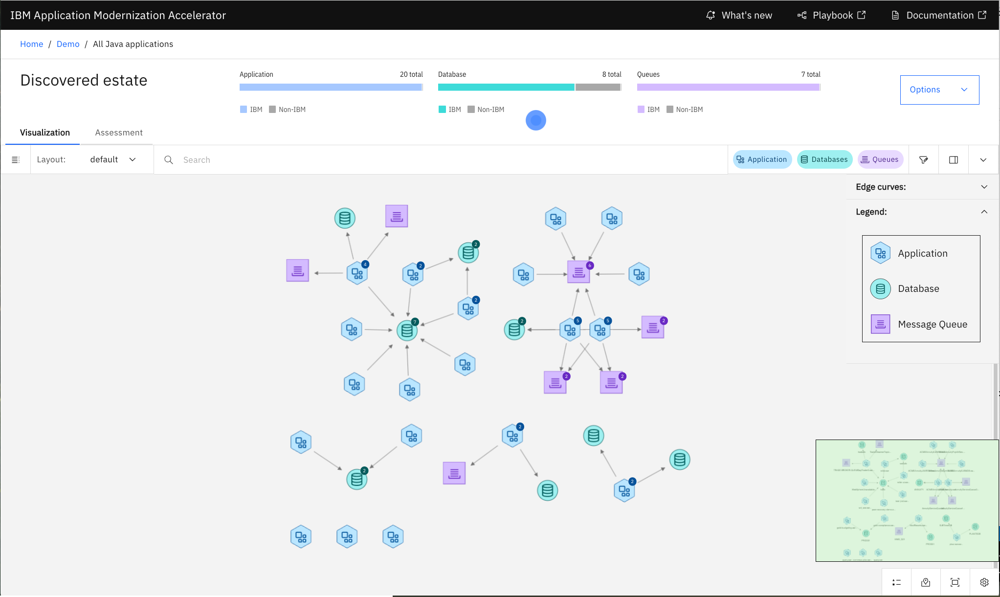
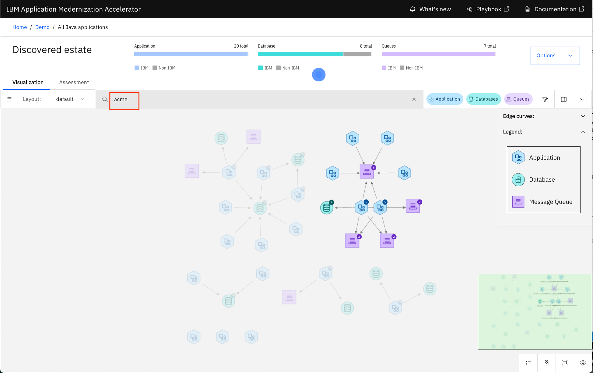
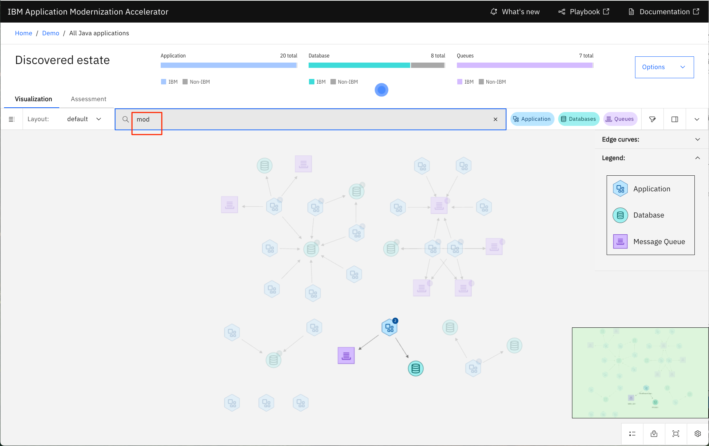
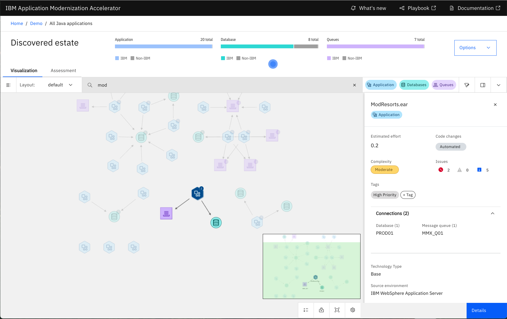
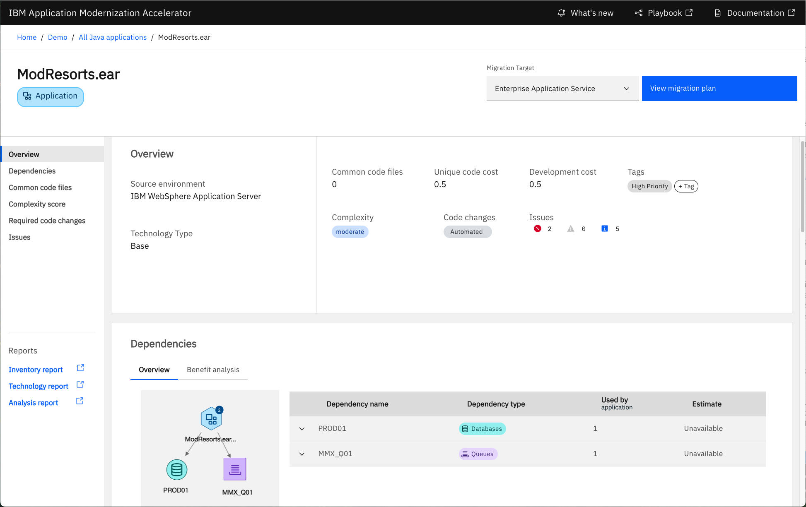
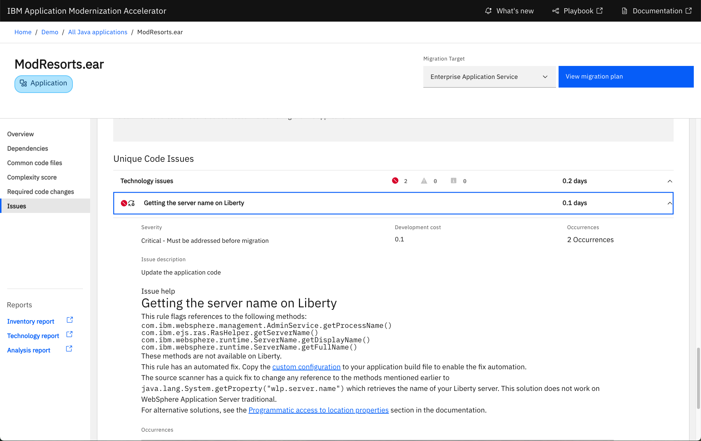
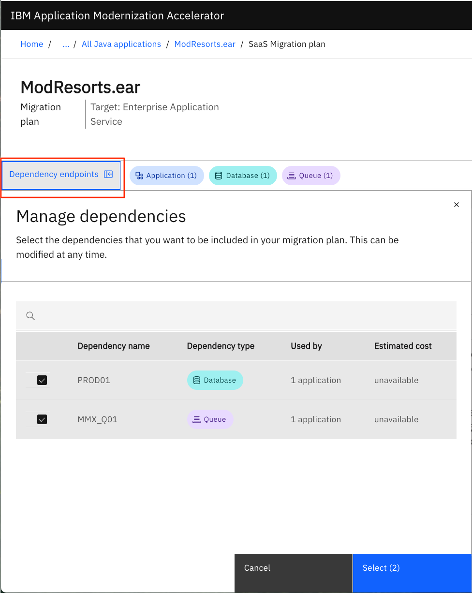
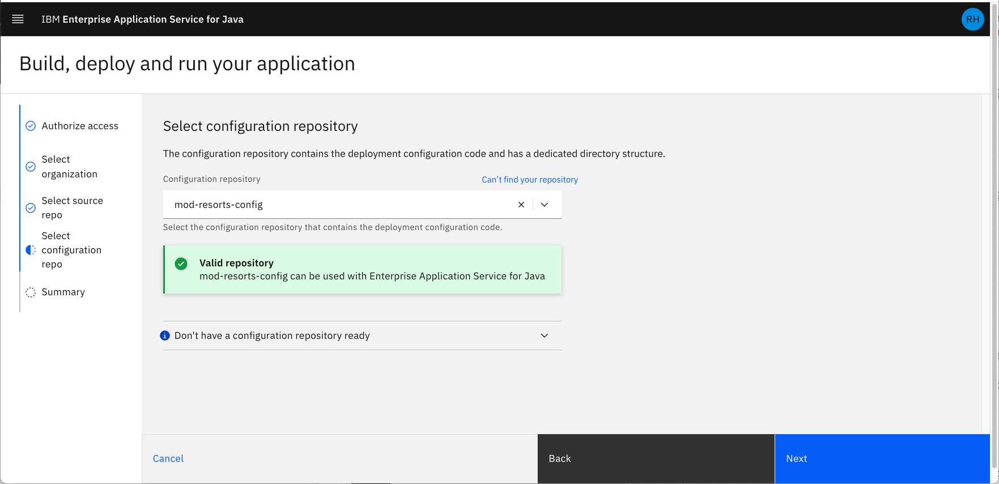
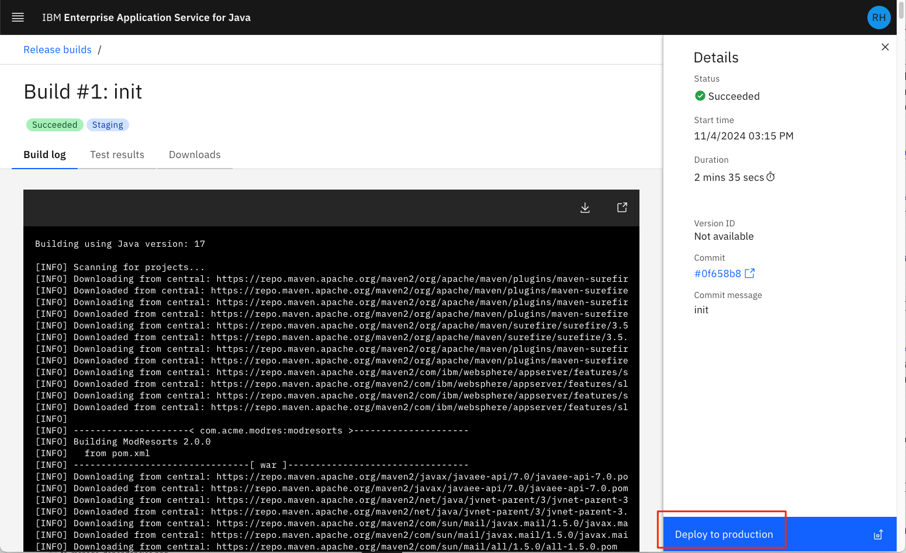

# Statement of Direction

This lab is based on early preview technology.  It is being shared under the terms of the following Statement of Direction: https://www.ibm.com/docs/en/announcements/statement-direction-enterprise-application-service-java

# Hands-on Modernization Lab

Modernization is essential to preserve the security and stability of your critical enterprise applications, and to be able to increase the delivery of new innovations. Modernization can take many forms, including adopting a more modern runtime, adopting Kubernetes/OpenShift, and refactoring to Microservices.  Many modernization projects struggle to deliver because of the complexity inherent in uprooting an application and its dependencies, understanding code written decades ago, and acquiring new skill for the destination environment. In this lab you'll use two new preview technologies that address these challenges:
1. Enterprise Application Service for Java. This is a new managed service which provides an end-to-end application delivery experience, including DevOps, GitOps, build & delivery pipelines, running applications, and observability integration. Being a fully managed service, it insulates you from the infrastructure complexities so you can focus on delivering the code.
2. Application Modernization Accelerator.  This tool enables you to discover existing enterprise applications and their database and messaging dependencies.  Assess the complexity of migration, plan a migration and then assist the migration (including database and messaging) through curated instructions, artefact generation and code rewrite rules.  Note, in the lab you will use an early driver which has the name Transformation Advisor.

In this lab you will use Application Modernization Accelerator (hereafter referred to as Transformation Advisor) to create a migration plan that includes automatically generated configuration files and scripts, guidance and pointers to tools that are needed to accelerate and complete the migration. 
 
This migration plan will include: 
- Details for the MQ administrator to configure the on-premises MQ network
- Details for the Db2 administrator to transfer the data from the on-premises database to the new Db2 SaaS
- Generated Liberty configuration files required to migrate the application

Transformation Advisor can then automatically provision, configure and wire together the Enterprise Application Service, MQ and Db2 SaaS services to support the application running in the cloud.
 
During the code remediation process, you will have the opportunity to utilize the services of WCA4EJA (watsonx Code Assistant for Enterprise Java Applications) to assist with code explanation, code completion, test generation, and also consume the output of Transformation Advisor to convert the application from WebSphere to Enterprise Application Service.
 
The generated files are then brought into GitHub where Enterprise Application Service will build the application. Deterministic changes to the application source code can be fixed automatically using pre-defined rules. Other fixes are facilitated through Generative AI where you can interact in a guided manner with a Java-trained LLM and generated code can be added to the application source.
 
Enterprise Application Service has a built-in CI/CD workflow for delivering applications, as follows:
1. Every time you create a Pull Request in GitHub, Enterprise Application Service will run a Pull Request build. You can then review the build, the test results.  
2. Once happy with the updates, you can merge the Pull Request to trigger a Release Build.  Again, you can review the build output, test results, and generated artefacts.
3. Releases are deployed through updates to a GitHub configuration repository.  Updating a staging environment yaml to reference the release will cause it to be deployed into a predefined Staging environment.  As with the code updates, PRs and PR merging can be used to achieve this.  Creating a PR will cause a Config validation build to run to check the configuration conforms to the deployment schema.
4. Once happy with the application in Staging, the release can be promoted to a pre-defined Production environment by making equivalent updates to the production environment yaml.

# Steps:

## 1. Discovering applications and planning your migration

Launch Transformation Advisor (TA) using the url **http:10.100.1.10:3000**:


### Discovery tool

A major capability of Transformation Advisor is discovery. The discovery tool is downloadable from TA and can be used on all major platforms:



The discovery tool can be executed on any system that you want analyzed. It will discover all of your relevant Java application runtimes (such as IBM WebSphere Application Server), and their database and messaging dependencies. The tools will also discover details about any discovered Db2 database instances.

The result of the discovery is then automatically uploaded into Transformation Advisor as a **Workspace**.

For the convenience of this lab, we have already run the discovery tool, and the results are stored in the **demoData** workspace.

### Explore the Discovery tool results

From the main TA panel, click on the workspace labelled **demoData**. This will display a topology map.



The map includes all the applications, databases and message queues, and their relationships, which were discovered from the scanned systems.


You also see the total number and type of each node:


You will also see several features to help you pan and zoom on the map.

Clicking on a specific node will bring up more details.


### Identify potential capabilities to modernize

Each set of connected nodes can be thought of as a **workload** that can be modernized. Let's filter our map to show the `Acme` workload.

Type **acme** in the field:



Here you see all the nodes associated with the **Acme** workload. As you can see, this is a very complex system, with multiple applications using multiple message queues and databases. You can use the dependency information to help you to decide where to start with modernization. Further details to help with this decision are also available and will be seen later. 

For the purpose of this lab, we will work on a simpler workload. This is how you would typically start a modernization project.  Starting simple helps you learn the tools and technologies.  Replace the field field with **mod**.



Now you see only three nodes highlighted, which looks like a much better option to start with.

Click on the application node (the blue hexagon) to see more details about ModResorts:



ModResorts appears to be a good candidate for modernization. Now let's explore this application and its dependencies in more detail.

### Modernize the ModResorts application

Click on the Assessment tab:


For the **Migration target**, select **EASe for Java**. This is the IBM Enterprise Application Service for Java managed service where we wish to build and deploy the application.

As you can see, the overall total development cost for the whole workload is 21 days.

Now let's focus on the ModResorts application. Scroll down and enter **modresorts** in the search bar to show the **ModResorts.ear** application:


Additionally, you see:
- this application has **Moderate** complexity, which means that code changes are required for ModResorts to work on Enterprise Application Service.
- there are 2 **Critical** issues and 5 **Information** issues. If you mouse over the issues you will see that Critical issues must be addressed, and Information issues are relevant in testing.
- the **Required code changes** column shows that we have an **Automated** way to resolve all the issues in the application.

Now click on the **ModResorts.ear** link to see the applications details page:



This panel contains all the detailed information about this application. 

Scroll down to the **Required code changes** section. Here you will see the build configuration you can use in a maven or gradle build to execute the rewrite rules to automatically resolve the issues in the application.  These same rules can also be executed within watsonx Code Assistant (see `Run auto-fixes` later in the lab).


Scroll down to the **Issues** section to see what the automated code changes will resolve.

Open the technology issues accordion to see the two Critical issues. Expand them to review the help – but remember these can be resolved automatically by executing the configuration changes provided. [**NOTE** You will do this later in the lab using IBM watsonx code assistant].



### Generating the migration plan

Now that we have reviewed all the details of the ModResorts application, it still looks like a good candidate for modernizing to the Cloud. Reasons include:
- all code changes can be automated.
- all dependencies (database and message queue) are not shared with 
other applications.

To start the migration, click the **Migration plan** button at the top of the panel.

The Migration plan page contains all of the details about what will be included in your migration bundle:


Click through and read the contents of each section (Note, some are placeholder instructions which are under development). 

At the bottom of the **EASe for Java** section you can see a preview of the files that are provided. Click on the `server.xml` file to get a preview:


This is the starting configuration used to run the server and application locally during development and local testing.

At the top left side of the panel, click the **Manage dependencies** button:



This panel shows all the dependencies that are part of this migration plan. If you do not want to modernize any of the dependencies, or if they are no longer relevant, you can remove them from the plan by deselecting them.

For this lab we will be modernizing all of the dependencies.

[Click on Create project in IBM Cloud. Nothing happens. This feature is not implemented in this driver, but when complete it will create a Cloud project and stand up and configure service instances for the application, databases and message queues defined in the migration plan. From there you can customize the instances to suit your needs.]

At the top right side of the panel, click the **Download plan** button. This will result in a zip file being downloaded to your local system.


You can explode this zip file bundle to see all the artifacts that TA provides, including a **README** file that gives you step by step instructions on how to use the bundle. You will use this bundle in the next section of the lab.

## 2. Modernize your application

### Clone the GitHub repo

1. Clone the ModResorts application.
   
    ```bash
    cd /home/admin
    git clone https://github.com/techxchange2024/mod-resorts.git
    ```

## Experiencing Watsonx Code Assistant for Enterprise Java Applications

This section will provide guidance on the usage of the features of Watsonx Code Assistant for Enterprise Java Applications.

### WebSphere Application Server modernization to Liberty with Watsonx Code Assistant for Enterprise Java Applications Eclipse IDE plugin

First, let’s start with **Eclipse IDE**. Please Locate and launch the Eclipse IDE from the Activities task bar.

1. After launching Eclipse, please import the ModResorts app as a Maven project by going to the
    **File** drop-down menu in the top left corner, then selecting
    **Import -\> Maven -\> Existing Maven Projects**.

1. Please note that to access Watsonx Code Assistant for Enterprise Java Applications, you will need to log in using the API key from IBM Cloud. Your instructor will provide you with the necessary API key. In Eclipse IDE, you can find the Watsonx Code Assistant for Enterprise Java Applications tab in the top panel of the interface.

    <div align="center">
        
    </div>

    After successfully logging into Watsonx Code Assistant for Enterprise Java Applications, you should see a greeting message from Watsonx Code Assistant for Enterprise Java Applications in the chat panel.

    <div align="center">
        
    </div>

1.  To ensure that the project is properly configured with the dependencies for the WebSphere Application Server APIs, please run the following commands in a terminal window to install the required dependencies into your local Maven project.

    ```bash
    cd mod-resorts
    mvn install:install-file -Dfile="was-dependency/was_public.jar" -DpomFile="was-dependency/was_public-9.0.0.pom"
    ```

1.  The application was configured and written using **traditional WebSphere Application Server** code, Watsonx Code Assistant for Enterprise Java Applications supports an automated AI powered feature to modernize this application to use the latest WebSphere Liberty Server. To access this feature, right-click on the project and select **Watsonx Code Assistant for Enterprise Java Applications → Modernize to Liberty**. You should see the Watsonx Code Assistant for Enterprise Java Applications extension interface.

    <div align="center">
        
    </div>

    > **NOTE**: Please wait for the console message `Retrieving the analysis report completed` before proceeding to the next step.
        <div align="center">
            
        </div>

    Click on the **Modernize project: modresorts** tab.

    <div align="center">
        
    </div>

1.  The tool has two options to migrate the project to Liberty, you can either **upload the migration bundle** which will provide Watsonx Code Assistant for Enterprise Java Applications with analysis and important configuration files to migrate to WebSphere Liberty or use the **binary scanner** if a migration bundle is not available. Note that using the migration bundle is recommended because it has been generated with the configuration information from where the Java application is running, while the binary scanner will not be able to obtain this information. The migration bundle option will be used in this demo. Please locate and open the bundle zip file you built and downloaded using `Transformation Advisor`.
    <div align="center">
        
    </div>

    <div align="center">
        
    </div>

1. Watsonx Code Assistant for Enterprise Java Applications will extract configuration files, including `server.xml` and `Containerfile`, from the migration bundle. The `server.xml` file contains the application's configuration, while the `Containerfile` can be used to build a Liberty image of your application. After reviewing these files, add them to the project folder by clicking on **Add Files to Project** to apply the changes.

    <div align="center">
        
    </div>

1.  Next, a modernization issues list will be presented with the must fix issue detected by Watsonx Code Assistant for Enterprise Java Applications. You can review each issue in detail by clicking on the expand button on the right-hand side of each item. The **Additional information** tab highlights other issues you should be aware of when migrating your application, though these do not require code changes. After the review is complete, click the **Run auto-fixes** button to apply the necessary changes.

    <div align="center">
        
    </div>

1.  After the auto-fix is completed, click on **Build and Refresh** to
    refresh the list. All the listed issue should be resolved.

    <div align="center">
        
    </div>

1.  Once migration is completed, you can add the Liberty maven plugin in the **pom.xml** file:

    ```bash
    <plugin>
        <groupId>io.openliberty.tools</groupId>
        <artifactId>liberty-maven-plugin</artifactId>
        <version>3.10.3</version>
    </plugin>
    ```

1.  Additonal, add links to the Db2 and MQ drivers. First we copy the drivers by add the following `resources` to the **pom.xml** file:

    ```bash
    <resources>
        <resource>
            <directory>${project.basedir}/src/main/resources</directory>
        </resource>
        <resource>
            <directory>${project.basedir}/db-drivers</directory>
            <targetPath>${project.build.directory}/liberty/wlp/usr/shared/config/lib/global</targetPath>
            <filtering>false</filtering>
        </resource>
        <resource>
            <directory>${project.basedir}/mq-drivers</directory>
            <targetPath>${project.build.directory}/liberty/wlp/usr/shared/config/lib/global</targetPath>
            <filtering>false</filtering>
        </resource>
    </resources>
    ```

    And then we reference the drivers by updating their location in the **server.xml** file:

    ```bash
    <library>
        <file name="{shared.config.dir}/lib/global/db2jcc.jar"/>
        <file name="{shared.config.dir}/lib/global/db2jcc_license_cu.jar"/>
        <file name="{shared.config.dir}/lib/global/db2jcc_license_cisuz.jar"/>
    </library>

    <resourceAdapter id="mqJmsRa" location="${shared.config.dir}/lib/global/wmq.jmsra.rar">
    ```

1.  Run the application in Liberty developer mode in the same terminal used in step 3. To view the application, please visit <http://localhost:9080/resorts>.

    ```bash
    mvn liberty:dev
    ```

1.  After you are finished checking out the application, stop the Liberty instance by pressing **CTRL+C** in the command-line session where you ran Liberty. Alternatively, you can run the **liberty:stop** goal from the current directory in another shell session:

    ```bash
    mvn liberty:stop
    ```

## 3. Deploy application to cloud using IBM Enterprise Application Service for Java (EASeJ)

Now that we have modernized our ModResorts application to use the Java **Liberty Runtime**, we will now need to deploy it to IBM Cloud. To accomplish this, we will be using the IBM EASeJ service.  

Provide the instructor with your email address associated with your GitHub account. You will then be assigned a student number that you can use throughout this section of the lab.

For convenience, each student will be given authorization to access to the following:

- GitHub Organization - **techxchange2024**
- GitHub **source** repo - **student-source-{number}**
- GitHub **config** repo - **student-config-{number}**
- IBM SaaS account - **techxchange2024-saas**
- IBM Application Flow subscription - **Application Flow**
- IBM EASeJ Service Instance - **student-{number}**

>**NOTE**: The **source** repo contains the "Liberty converted" version of the ModResorts app that we updated in the last section.

>**IMPORTANT**: You will receive an email regarding access to the **techxchange2024** GitHub Organization. You must accept accept the invitation in order to complete this section of the lab.

### Access your EASeJ service instance

1. Use this link to start:

    https://ibm-cloud.console.saas.ibm.com

    <div align="center">
        
    </div>

    Select the **techxchange2024-saas** account and click **Next**.

1. Click the **View instances** link to bring up the **Instance** list.

    <div align="center">
        
    </div>

1. Select your instance.

    <div align="center">
        
    </div>

    From the list of instances, **Open** the instance associated with your student number.


### Configure GitHub repos for your EASeJ instance

1. Since no GitHub repos have been assigned to your instance, you will see the following panel:

    <div align="center">
        
    </div>

    Click **Install and configure** to continue.

    <div align="center">
        
    </div>

    Click the **Build, Deploy & Run** option.

    This will start a series of steps for you to setup and authorize access to your GitHub account and your application repos (**source** and **config**).

    Click `Next`.

1. Authorize access to GitHub.
   
    <div align="center">
        
    </div>

    Click **Authorize access to GitHub** and enter your GitHub account information. 
    
    <div align="center">
        
    </div>
       
    Once authorized, click **Next**.

    <div align="center">
        
    </div>

1. Select an organization

    <div align="center">
        
    </div>

    Select the **techxchange2024** organization and click **Next**.

    >**NOTE**: To use the EASeJ service, all GitHub repos must be assigned to a GitHub Organization.

1. Assign GitHub source and config repo

    Select your student assigned source and configuration GitHub repositories and click **Next**.

    <div align="center">
        
    </div>

    <div align="center">
        
    </div>

1. Confirm GitHub settings

    <div align="center">
        
    </div>

    Confirm your settings and click **Finish**.

1. Navigate EASeJ console

    Once confirmed, you will see the EASeJ console.

    <div align="center">
        
    </div>

    Use the icon in the upper left to show the menu options.

    <div align="center">
        
    </div>

    Note that the **Builds** menu options are related to your **source** code repo, and the **Configuration jobs** menu options are related to your **config** repo.

### EASeJ flow process

Once you confirmed your application repos, a **Release build** is automatically started.

1. From the menu, select **Builds** -> **Release builds**.

    <div align="center">
        
    </div>

    Click the **Build ID** to bring up the **Build log**.

    <div align="center">
        
    </div>

    If successful, you will see a **Deploy to staging** button. Click the button to get instructions on how to deploy your application.

    <div align="center">
        
    </div>

    In order to deploy, you will need to update the associated **config** repo, using the **Version ID** value displayed on the instructions page.

1. Update config file with version ID
   
    Using the editor directly in your GitHub config repo, edit the environments/staging/environment.yaml file.

    Paste the ID as the version key value. [Note: keep the double quotes]

    <div align="center">
        
    </div>

    After editing the file, click the **Commit changes...** button.

    In the **Propose changes** panel, make sure you select to **Create a new branch** option.

    <div align="center">
        
    </div>

    Click **Propose changes** to create generate a pull request.

    Then click the button to create a Pull Request.

    This will generate a **configuration job** event in the EASeJ console. This can be viewed by selecting the **Configuration jobs** -> **Configuration validations** menu option.

    <div align="center">
        
    </div>

    Your GitHub PR panel will show that it is in a **Checks** phase until the validation check is complete. 

    Once complete, merge and confirm your pull request into the **Main** branch of your repo.

    The PR merge will generate a **deployment** event in the EASeJ console. This can be viewed by selecting the **Configuration jobs** -> **Deployments** menu option. [Note that this step may take a few minutes].

    <div align="center">
        
    </div>

### Promote to staging environment and run application

Upon succesful completion of the **Deploy** phase, EASeJ will automatically start the **Staging** phase.

1. Click **Environments** -> **Staging** to view the staging job.

    <div align="center">
        
    </div>

    Note that the **Release build** number should match the latest **Deployment Job ID**. If you click the **Release build** number link, it will take you back to the corresponding **Deployment** job.

    At the bottom of the panel is a build log. For our ModResorts app, you can see here that it was successfully started:

    <div align="center">
        
    </div>

1. To launch the application, click on **Actions** -> **Open application**.

    Initially, you will get a `404` error because a context path must be provided.

    Add **/resorts** to the end of the URL to provide the proper path.

    <div align="center">
        
    </div>

### Modify application source code

Now that you know how the process works, lets make a change to the source repo and see what additional steps are required.

1. Using the editor directly in your GitHub **source** repo, make a simple change to the **README.md** file. 

    After editing the file, click the **Commit changes...** button.

    In the **Propose changes** panel, make sure you select to **Create a new branch** option.

    <div align="center">
        
    </div>

    Then click the button to create a **Pull Request**.

2. This will generate a **PR build** event in the EASeJ console. This can be viewed by selecting the **Builds** -> **PR builds** menu option.

    <div align="center">
        
    </div>

    Your GitHub PR panel will show that it is in a **Checks** phase until the PR build is complete. 

    <div align="center">
        
    </div>

    Once the PR build is complete, merge and confirm your pull request into the Main branch of your repo.

3. The PR merge will generate a **Release build** event in the EASeJ console. This can be viewed by selecting the **Builds** -> **Release builds** menu option.

    <div align="center">
        
    </div>

    Click on the **Build ID** number to bring up details on the build.

    <div align="center">
        
    </div>

    Once completed, it will display a status label to indicate if it **Succeeded** or **Failed**.

    If errors occurred, the **Build log** can help you track the issue.

    Click on the **Downloads** tab to see the assets generated by the build.

    <div align="center">
        
    </div>

### Deploy the new version of the app

Once the application changes have been merged and built, we need to update the associated **config** repo to deploy it.

The steps required will follow the same flow as described above.

>**NOTE**: **[SaaS]** and **[GitHub]** indicates which UI you will be using to perform the step.

1. **[SaaS]** Click the **Deploy to staging** button.
   
2. **[SaaS]** Copy the **Version ID** value.
   
3. **[GitHub]** Edit the **environments/staging/environment.yaml** file in your GitHub **config** repo.
   
4. **[GitHub]** Paste the ID as the **version** key value. [Note: keep the double quotes]
   
5. **[GitHub]** Commit the change using the **Create a new branch** option.
   
6. **[GitHub]** Click the button to create a **Pull Request**.
   
7. **[SaaS]** The pull request will generate a **Validation** event. View the job by selecting the **Configuration jobs** -> **Configuration validations** menu option.
   
8. **[GitHub]** Once complete, merge and confirm your pull request into the Main branch of your GitHub **config** repo.
   
9. **[SaaS]** Merging the pull request will generate a **Deployment** event. View the job by selecting the **Configuration jobs** -> **Deployments** menu option.
    
10. **[SaaS]** After successful completion of the **Deploy** phase, EASeJ will automatically start the **Staging** phase.
    
11. **[SaaS]** Click **Environments** -> **Staging** to view the staging job.
    
12. **[SaaS]** Click on **Actions** -> **Open application** to view the application. [Don't forget to add the **/resorts** context to the URL]
